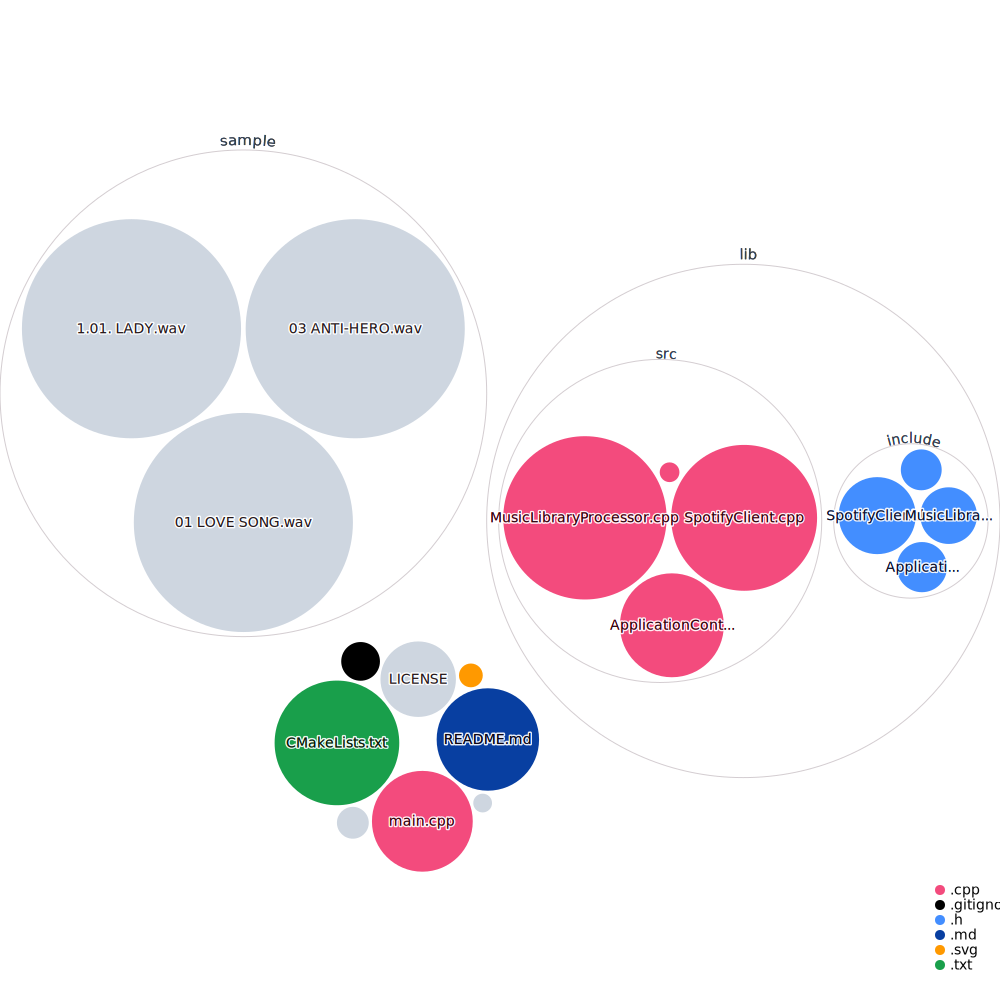

# music-rec
 
# Visualization of this repository


# Music Recommendation Program

## Introduction

The Music Recommendation Program is a C++ application that utilizes the power of audio analysis and machine learning to recommend music tracks based on a given directory of WAV files. It takes into account a client ID and client secret for authentication and provides users with either a recommended playlist or a single song recommendation.

## Features

- Analyzes WAV files in a specified directory.
- Utilizes client ID and client secret for authentication.
- Generates a recommended playlist based on audio analysis.
- Provides a single-song recommendation option.

## Usage

To use the Music Recommendation Program, follow these steps:

1. Ensure you have a directory containing the WAV files you want to analyze.

2. Obtain a client ID and client secret from Spodify and provide them as arguments when running the program.

   ```bash
   ./music-rec /path/to/wav/files client_id client_secret
   ```

3. The program will process the audio files, and depending on your choice, it will either generate a recommended playlist or provide a single song recommendation.

## Examples

### Generate a Recommended Playlist

```bash
./music-rec /path/to/wav/files client_id client_secret -p
```

### Get a Single Song Recommendation

```bash
./music-rec /path/to/wav/files client_id client_secret -s
```

## Dependencies

This program relies on the following libraries and tools:

- [audioFile](link-to-audioFile): A library for audio file input and output.
- [Gist](link-to-Gist): A library for [specific functionality].
- [tagLib](link-to-tagLib): A library for working with audio metadata.
- [cpr](link-to-cpr): A library for HTTP requests.
- [spotify](link-to-spotify): A library for [specific functionality].
- [glaze](link-to-glaze): A library for [specific functionality].


## Acknowledgments

- Dr. Fontenot :)
